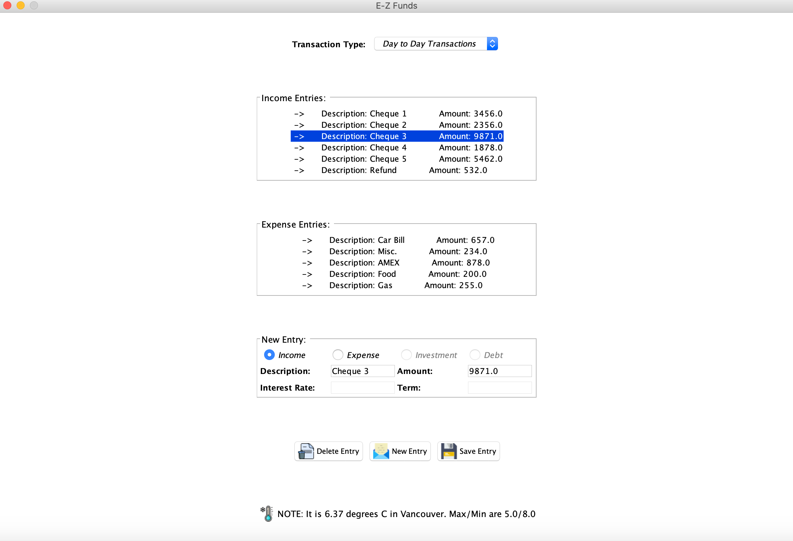
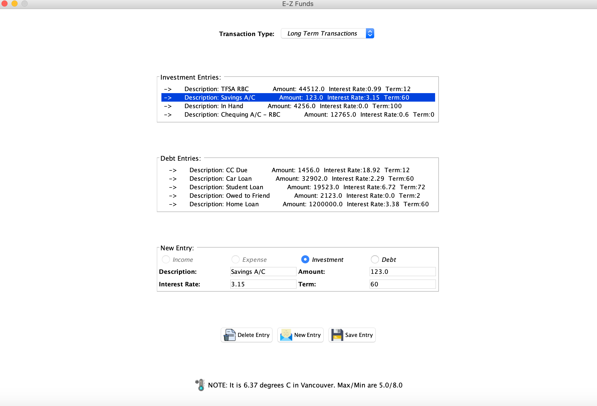
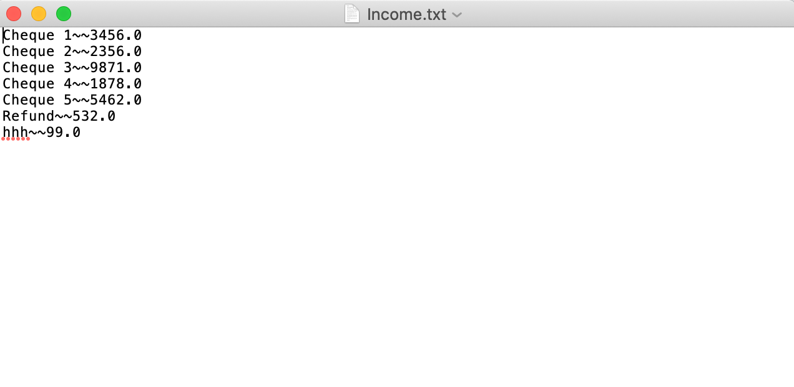

# Finance-Tracker

Java program that allows users to manage day to day and long term finances. 

E-Z Funds allows users to track details of income, expenses as well as debts and investments so that they can track their finances. The program saves and loads user data from local data files. The GUI is designed using Swing and unit testing done using JUnit. Program also makes API calls and parses JSON data to display updated weather information. Built using OOP principles including inheritance, data abstraction and polymorphism.

## Program Screenshots:

**General layout of the _Short-Term_ _Transactions_ Module:**

**General layout of the _Long-Term_ _Transactions_ Module:**

**Demonstration of the user interface:**

**Sample data file containing _income__transactions_. User data is saved to and loaded from such files:**

